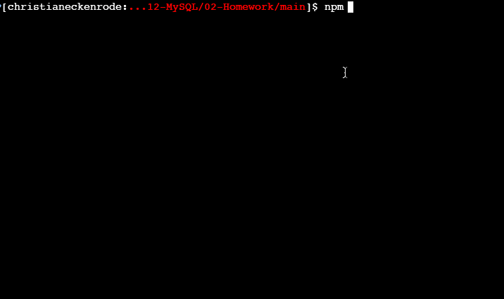

# Employee Tracker

## Description
An application that can be used to write, save, and delete notes. This application uses an Express.js backend and saves and retrieves note data from a JSON file that is deployed on Heroku.

## User Story
AS A business owner
I WANT to be able to view and manage the departments, roles, and employees in my company
SO THAT I can organize and plan my business.

## Acceptance Criteria
- GIVEN a command-line application that accepts user input
- WHEN I start the application
- THEN I am presented with the following options: view all departments, view all roles, view all employees, add a department, add a role, add an employee, and update an employee role
- WHEN I choose to view all departments
- THEN I am presented with a formatted table showing department names and department ids
- WHEN I choose to view all roles
- THEN I am presented with the job title, role id, the department that role belongs to, and the salary for that role
- WHEN I choose to view all employees
- THEN I am presented with a formatted table showing employee data, including employee ids, first names, last names, job titles, departments, salaries, and managers that the employees report to
- WHEN I choose to add a department
- THEN I am prompted to enter the name of the department and that department is added to the database
- WHEN I choose to add a role
- THEN I am prompted to enter the name, salary, and department for the role and that role is added to the database
- WHEN I choose to add an employee
- THEN I am prompted to enter the employee’s first name, last name, role, and manager and that employee is added to the database
- WHEN I choose to update an employee role
- THEN I am prompted to select an employee to update and their new role and this information is updated in the database 

## Mock-Up

## Github Repository
All files and changes made are located on github at the following location:

https://github.com/htang2021/employee-tracker

## Deploy Your Project
This instruction below assumes that a project and repo were already created on github and that they are already linked as appropriate.
(https://github.com/htang2021/employee-tracker).

1. From the local CLI at the root of the project repo, do a git clone or git pull
2. Install the appropriate NPM packages dependencies, $ npm install
3. Verify, or create if needed, that .gitignore include node_modules/, .DS_Store, package-lock.json, and .env entries
4. Perform git add, commit, and push as appropriate to baseline the deployment repository
5. Log into a local database via MySQL2 client
6. Once at SQL> interface, create a database 'employee_tracker'
7. From SQL>, type the three commands to insert seed data into the DB:
 - SQL> source db/db.sql
 - SQL> source db/schema.sql
 - SQ>> source db/seeds.sql
8. Verify that all seed data is in place
9. Exit SQL> by typing exit;
10. Issue command 'npm start' to run the application, select 'Quit' to exit out of application.

## Known Issues
- In a default git-bash environment, the screen does not scroll properly and thus causes the output and instruction to overlap that makes it hard to read
- Employee role update does not work
- After the initial pass of the selection prompt, and displays its output, the second pass of the selection prompt does not get executed - recursive logic has not been implemented
- Code should be refactored

## Testing
- Able to view table role
- Able to view table department
- Able to view table employee
- Verify that user sensitive information is not visible on GitHub by going to the github location and check to see if .env is visible and if the DB connection username/password or database name is visible
- Verify that a role can be added
- Verify a new department can be added to table department
- Verify that an employee can be added
- Verify the role and manger of an employee can be updated

## Questions
Feel free to reach out to [me](mailto:hungtang@hotmail.com).

README.md - updated by Hung Tang on 4/25/21